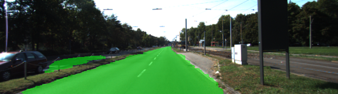
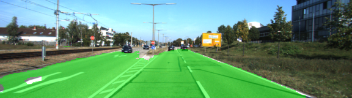
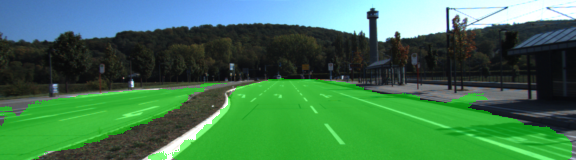

# Semantic Segmentation
### Gary Holness

### Introduction
In this project, you'll label the pixels of a road in images using a Fully Convolutional Network (FCN).

### Setup
##### GPU
`main.py` will check to make sure you are using GPU - if you don't have a GPU on your system, you can use AWS or another cloud computing platform.
##### Frameworks and Packages
Make sure you have the following is installed:
 - [Python 3](https://www.python.org/)
 - [TensorFlow](https://www.tensorflow.org/)
 - [NumPy](http://www.numpy.org/)
 - [SciPy](https://www.scipy.org/)

You may also need [Python Image Library (PIL)](https://pillow.readthedocs.io/) for SciPy's `imresize` function.

##### Dataset
Download the [Kitti Road dataset](http://www.cvlibs.net/datasets/kitti/eval_road.php) from [here](http://www.cvlibs.net/download.php?file=data_road.zip).  Extract the dataset in the `data` folder.  This will create the folder `data_road` with all the training a test images.

### My Work
##### Implement
My code was implemented in `main.py` module for the following changes...

load_vgg:  line 23
layers:  line 55
optimize: line 128
train_nn: line 150
run:  line 195

My implementation followed the Q&A video made available as part of the project
definition module.  My implementation uses the VGG network as the encoder and
implements decoder using Tensorflow's conv2d_transpose for upsampling and 
1x1 convolution.   In addition, VGG's fully connected layer was replaced with
a fully convolutional layer.

I also implmented some timing printouts as part of reporting for this project.
##### Run
Run the following command to run the project:
```
python main.py
```

#### Example Outputs
The network was tested initially using 5 epocs and batch size of 5 in order to test
out the code to ensure it worked. This was important for development as I ran on
an Amazon AWS GPU instance, so I didn't want testing to run for too long because
it would end up costing more money for longer compute times during testing cycles.

My final version used 30 epocs and batch size of 10.  The complete meta information
is as follows

epocs: 30
batch size:  10
keep_probability:  0.5

I included some figures..








The training output is as follows...

2018-12-26 06:13:05.241394: I tensorflow/stream_executor/cuda/cuda_gpu_executor.cc:893] successful NUMA node read from SysFS had negative value (-1), but there must be at least one NUMA node, so returning NUMA node zero
2018-12-26 06:13:05.241755: I tensorflow/core/common_runtime/gpu/gpu_device.cc:940] Found device 0 with properties:
name: Tesla M60
major: 5 minor: 2 memoryClockRate (GHz) 1.1775
pciBusID 0000:00:1e.0
Total memory: 7.43GiB
Free memory: 7.36GiB
2018-12-26 06:13:05.241778: I tensorflow/core/common_runtime/gpu/gpu_device.cc:961] DMA: 0
2018-12-26 06:13:05.241799: I tensorflow/core/common_runtime/gpu/gpu_device.cc:971] 0:   Y
2018-12-26 06:13:05.241812: I tensorflow/core/common_runtime/gpu/gpu_device.cc:1030] Creating TensorFlow device (/gpu:0) -> (device: 0, name: Tesla M60, pci bus id: 0000:00:1e.0)
2018-12-26 06:13:05.325454: I tensorflow/core/common_runtime/gpu/gpu_device.cc:1030] Creating TensorFlow device (/gpu:0) -> (device: 0, name: Tesla M60, pci bus id: 0000:00:1e.0)
2018-12-26 06:13:05.326663: I tensorflow/core/common_runtime/gpu/gpu_device.cc:1030] Creating TensorFlow device (/gpu:0) -> (device: 0, name: Tesla M60, pci bus id: 0000:00:1e.0)
2018-12-26 06:13:12.509274: I tensorflow/core/common_runtime/gpu/gpu_device.cc:1030] Creating TensorFlow device (/gpu:0) -> (device: 0, name: Tesla M60, pci bus id: 0000:00:1e.0)
2018-12-26 06:13:12.520004: I tensorflow/compiler/xla/service/platform_util.cc:58] platform CUDA present with 1 visible devices
2018-12-26 06:13:12.520027: I tensorflow/compiler/xla/service/platform_util.cc:58] platform Host present with 16 visible devices
2018-12-26 06:13:12.524249: I tensorflow/compiler/xla/service/service.cc:198] XLA service 0x4d4fdc0 executing computations on platform Host. Devices:
2018-12-26 06:13:12.524268: I tensorflow/compiler/xla/service/service.cc:206]   StreamExecutor device (0): <undefined>, <undefined>
2018-12-26 06:13:12.524436: I tensorflow/compiler/xla/service/platform_util.cc:58] platform CUDA present with 1 visible devices
2018-12-26 06:13:12.524452: I tensorflow/compiler/xla/service/platform_util.cc:58] platform Host present with 16 visible devices
2018-12-26 06:13:12.527439: I tensorflow/compiler/xla/service/service.cc:198] XLA service 0x4de6530 executing computations on platform CUDA. Devices:
2018-12-26 06:13:12.527458: I tensorflow/compiler/xla/service/service.cc:206]   StreamExecutor device (0): Tesla M60, Compute Capability 5.2
2018-12-26 06:13:12.735520: I tensorflow/core/common_runtime/gpu/gpu_device.cc:1030] Creating TensorFlow device (/gpu:0) -> (device: 0, name: Tesla M60, pci bus id: 0000:00:1e.0)
2018-12-26 06:13:12.744924: I tensorflow/core/common_runtime/gpu/gpu_device.cc:1030] Creating TensorFlow device (/gpu:0) -> (device: 0, name: Tesla M60, pci bus id: 0000:00:1e.0)
TensorFlow Version: 1.2.1
Default GPU Device: /gpu:0
Tests Passed
Tests Passed
Tests Passed
Tests Passed
Tests Passed
Epoch,  1 , Runtime:  50.89419412612915 , Mean Batch Loss:  0.490051 , Batch Loss StdDev:  0.133009
Epoch,  2 , Runtime:  44.940343379974365 , Mean Batch Loss:  0.233823 , Batch Loss StdDev:  0.0461134
Epoch,  3 , Runtime:  44.980141162872314 , Mean Batch Loss:  0.150699 , Batch Loss StdDev:  0.0204285
Epoch,  4 , Runtime:  45.00878977775574 , Mean Batch Loss:  0.128702 , Batch Loss StdDev:  0.0271493
Epoch,  5 , Runtime:  44.945115089416504 , Mean Batch Loss:  0.108029 , Batch Loss StdDev:  0.0210238
Epoch,  6 , Runtime:  45.093568563461304 , Mean Batch Loss:  0.087152 , Batch Loss StdDev:  0.0141187
Epoch,  7 , Runtime:  45.087300062179565 , Mean Batch Loss:  0.0792464 , Batch Loss StdDev:  0.0113001
Epoch,  8 , Runtime:  44.99946165084839 , Mean Batch Loss:  0.070387 , Batch Loss StdDev:  0.0129727
Epoch,  9 , Runtime:  45.0148491859436 , Mean Batch Loss:  0.0633465 , Batch Loss StdDev:  0.011541
Epoch,  10 , Runtime:  44.99654197692871 , Mean Batch Loss:  0.0578044 , Batch Loss StdDev:  0.0109746
Epoch,  11 , Runtime:  44.94038987159729 , Mean Batch Loss:  0.0560474 , Batch Loss StdDev:  0.0145596
Epoch,  12 , Runtime:  44.979660987854004 , Mean Batch Loss:  0.0549649 , Batch Loss StdDev:  0.0094545
Epoch,  13 , Runtime:  44.91737365722656 , Mean Batch Loss:  0.0479325 , Batch Loss StdDev:  0.00859258
Epoch,  14 , Runtime:  45.06717610359192 , Mean Batch Loss:  0.0461312 , Batch Loss StdDev:  0.00651611
Epoch,  15 , Runtime:  44.95999312400818 , Mean Batch Loss:  0.0427284 , Batch Loss StdDev:  0.00760824
Epoch,  16 , Runtime:  45.03348422050476 , Mean Batch Loss:  0.0406612 , Batch Loss StdDev:  0.00493845
Epoch,  17 , Runtime:  44.951544523239136 , Mean Batch Loss:  0.0396619 , Batch Loss StdDev:  0.00848849
Epoch,  18 , Runtime:  45.00323462486267 , Mean Batch Loss:  0.0380602 , Batch Loss StdDev:  0.00557027
Epoch,  19 , Runtime:  45.00761604309082 , Mean Batch Loss:  0.0362562 , Batch Loss StdDev:  0.00586786
Epoch,  20 , Runtime:  44.982380628585815 , Mean Batch Loss:  0.0344615 , Batch Loss StdDev:  0.00502114
Epoch,  21 , Runtime:  44.98419260978699 , Mean Batch Loss:  0.0347549 , Batch Loss StdDev:  0.00477687
Epoch,  22 , Runtime:  44.989508628845215 , Mean Batch Loss:  0.0642747 , Batch Loss StdDev:  0.0263653
Epoch,  23 , Runtime:  45.009358406066895 , Mean Batch Loss:  0.0500516 , Batch Loss StdDev:  0.00974399
Epoch,  24 , Runtime:  45.00966167449951 , Mean Batch Loss:  0.0394393 , Batch Loss StdDev:  0.00736215
Epoch,  25 , Runtime:  44.95262360572815 , Mean Batch Loss:  0.0346455 , Batch Loss StdDev:  0.00546887
Epoch,  26 , Runtime:  44.904072523117065 , Mean Batch Loss:  0.03224 , Batch Loss StdDev:  0.00399068
Epoch,  27 , Runtime:  44.85687828063965 , Mean Batch Loss:  0.0305057 , Batch Loss StdDev:  0.00472574
Epoch,  28 , Runtime:  44.87743139266968 , Mean Batch Loss:  0.029583 , Batch Loss StdDev:  0.00585789
Epoch,  29 , Runtime:  44.960593938827515 , Mean Batch Loss:  0.0285893 , Batch Loss StdDev:  0.00393637
Epoch,  30 , Runtime:  44.95927047729492 , Mean Batch Loss:  0.0285633 , Batch Loss StdDev:  0.00540033
total training time:  1355.3132762908936
Training Finished. Saving test images to: ./runs/1545806155.558644

### Submission
1. My code passes all of the tests
2. My code meets the rubric criteria for Building the Neural Network and Neural Network Training
3. Zip File Submission containing 
 - `helper.py`
 - `main.py`
 - `project_tests.py`
 - Newest inference images from `runs` folder  (**all images from the most recent run**)
 
